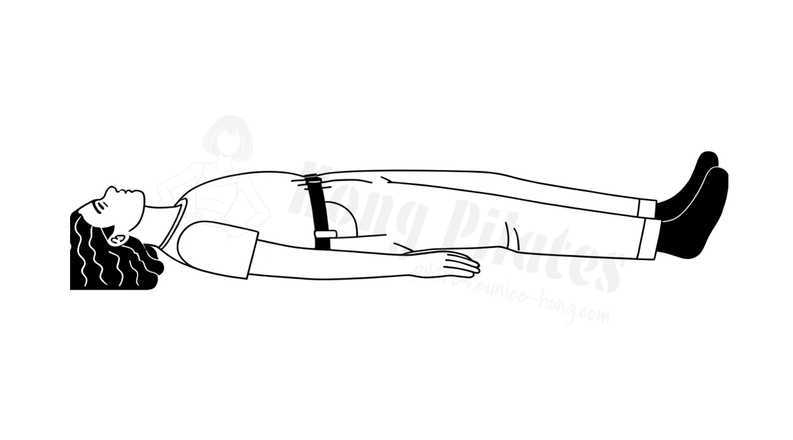

앙와위(仰臥位, Supine position)는 사람이 취할 수 있는 자세의 일종으로,
등을 아래쪽으로 하고 가슴을 위쪽으로 하여 엎드리는 자세, 즉 해부학적으로 배쪽이 위, 등쪽이 아래인 자세를 의미한다.
이러한 자세에서는 손바닥이 아래쪽을 향하게 되며, 아래팔의 자뼈와 노뼈가 서로 평행하게 위치한다.

# 준비 자세

1. 매트에 누워 약 무릎은 골반 너비로 둔다
2. 무릎은 90° 구부려 매트에 내려 놓는다
3. 양팔은 편안히 몸통 옆에 내려 놓는다

# 목적

1. 호흡 조절 및 심호흡 연습
2. 긴장 완화 및 이완
3. 척추 및 골반 정렬 개선
4. 코어 근육 활성화

# Cueing

1. 흉곽이 풍선처럼 커진다고 생각한다
2. 내쉬는 호흡 엔 풍선에서 바람이 빠진다고 생각한다
3. 어깨를 살짝 손으로 눌러 견갑골이 거상되지 않도록 한다

# 주의 사항

1. [[../exercise/중립#척추|척추 중립]]은 유지한다.
2. 가슴이 과도하게 들리지 않도록 한다
3. 견갑골이 거상 되지 않도록 한다

# 변형 동작

1. [[엎드려 누운 자세|Prone position]] 에서 호흡 연습
2. [[저항 밴드|밴드]]를 활용
3. 자신의 손을 흉곽 부에 놓고 움직임을 느낄 수 있도록 한다

# 참고 문서

1. [앙와위](https://ko.wikipedia.org/wiki/%EC%95%99%EC%99%80%EC%9C%84)
