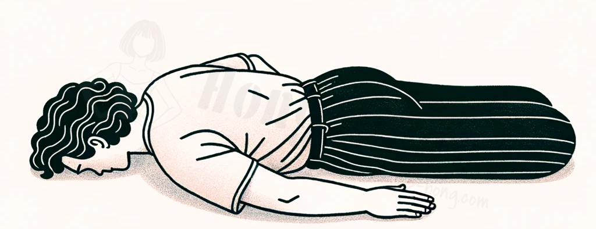

복위(伏位, Prone position) 또는 복와위(伏臥位)는 사람이 취할 수 있는 자세의 일종으로, 
가슴을 아래쪽으로 하고 등을 위쪽으로 하여 엎드리는 자세, 즉 해부학적으로 배쪽이 아래, 등쪽이 위인 자세를 의미한다. 
이러한 자세에서는 손바닥이 위쪽을 향하게 되며, 아래팔의 자뼈와 노뼈가 서로 교차하게 된다.

# 준비 자세

- 매트에 엎드려 양손을 포개어 바닥에 대 주고, 이마를 손 등 위에 올려 준다.
- 팔꿈치도 바닥에 대주고 바깥 쪽을 향하게 해준다

# 목적

1. 흉곽의 움직임을 인지 한다.
2. 원활한 장기 활동에 도움을 준다.

# Cueing

1. 들이 쉬는 호흡에 흉곽이 풍선처럼 커진다고 생각한다.
2. 내쉬는 호흡에선 배꼽을 바닥에서 뗀다고 생각한다.
3. 내쉬는 호흡에서 풍선에 바람이 빠진다고 생각한다.

# 주의 사항

1. 어깨가 거상이 되지 않도록 한다.
2. [[../exercise/중립#척추|척추 중립]]을 유지한다.
3. 가슴이 너무 들리지 않도록 한다.

# 참고 문서

- [엎드려 누운 자세](https://en.wikipedia.org/wiki/Prone_position)